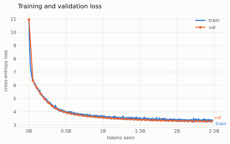
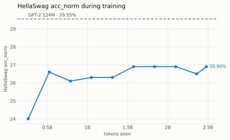
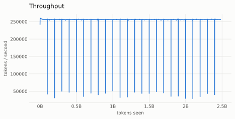

# Build GPT-2 from Scratch

A compact GPT-2 124M training stack written in PyTorch, built to understand the full path from token shards to multi-GPU training rather than relying on a high-level trainer.

The implementation is inspired by Andrej Karpathy's `build-nanogpt` walkthrough and reorganized here as a small engineering codebase with explicit model, data, distributed, optimizer, scheduler, generation, and test modules.

<p align="center">
  <picture>
    <source media="(prefers-color-scheme: dark)" srcset="assets/logo-dark.svg">
    <source srcset="assets/logo-light.svg">
    
  </picture>
</p>

<h1 align="center">Build-GPT-2</h1>

<p align="center">
  GPT-2 124M from scratch in PyTorch, trained on FineWeb-Edu with multi-GPU DDP.
</p>

## What this project demonstrates

- GPT-2-style decoder-only Transformer implemented from scratch
- GPT-2 weight tying and initialization
- PyTorch scaled dot-product attention (`scaled_dot_product_attention`)
- FineWeb-Edu data stored as pre-tokenized NumPy shards
- Rank-aware multi-GPU data loading
- DistributedDataParallel + NCCL
- BF16 autocast
- Gradient accumulation to a 524,288-token global batch
- Fused AdamW when available
- Linear warmup + cosine LR decay
- Validation and autoregressive top-k generation
- Crash-safe checkpointing with exact resume (optimizer state, LR schedule position, data loader position)
- HellaSwag evaluation with `acc` / `acc_norm`, validated against GPT-2 124M
- Optional Weights & Biases logging that survives a resume as a single run
- Unit tests for model shapes, LR scheduling, and data partitioning

## Results

One run of the configuration below, trained from scratch on FineWeb-Edu.

| | Value |
|---|---:|
| Model | GPT-2 124M (124,475,904 parameters) |
| Training tokens | 2.48B (4,730 steps × 524,288) |
| Hardware | 4 × NVIDIA A40 |
| Precision | BF16 autocast, TF32 matmuls |
| Throughput | 256,122 tokens/s (median) |
| Wall time | 2.8 hours |
| **Final validation loss** | **3.2751** |
| **HellaSwag `acc_norm`** | **27.00%** |
| HellaSwag `acc` | 27.07% |

Both HellaSwag figures come from the full 10,042-example validation split via
`scripts/eval_hellaswag.py`, which is also how the reference below was measured — the two
numbers are the same measurement, so the comparison is meaningful.

| | `acc` | `acc_norm` | Training tokens |
|---|---:|---:|---:|
| Random chance | 25.00% | 25.00% | — |
| **This run** | **27.07%** | **27.00%** | 2.48B |
| OpenAI GPT-2 124M | 28.58% | 29.55% | ~100B |

The useful reading is not "below GPT-2" but the ratio: **44% of the achievable gap closed on
2.5% of the training tokens.** Capability improves roughly logarithmically with data, so the
remaining 2.5 points are far more expensive than the first 2.

<p align="center">
  <picture>
    <source media="(prefers-color-scheme: dark)" srcset="assets/loss-dark.svg">
    
  </picture>
</p>

Validation loss tracks training loss throughout, with no divergence — at 2.48B tokens over 2.5B
tokens of unique data the model sees each example roughly once, so there is nothing to overfit.

<p align="center">
  <picture>
    <source media="(prefers-color-scheme: dark)" srcset="assets/eval-dark.svg">
    
  </picture>
</p>

HellaSwag is worth reading carefully. It rises over the first ~0.5B tokens and then sits between
26.1% and 26.9% for the remaining 80% of training, while validation loss keeps falling from 3.67
to 3.28. Two things are going on: the metric's entire dynamic range at this scale is 4.55 points
wide (chance to GPT-2), and each in-training point is measured on 1,000 examples, giving a 95%
interval of ±2.7 points. Movement after the first thousand steps is mostly inside the noise.

The lesson is to steer on validation loss and treat HellaSwag as an end-of-run check, not a
training signal.

One incidental observation: for GPT-2, `acc_norm` sits a full point above `acc`, whereas here
the two are within 0.07 points of each other. Length normalization recovers signal when the
per-token likelihoods are already well ordered; an under-trained model gives it less to work
with.

<p align="center">
  <picture>
    <source media="(prefers-color-scheme: dark)" srcset="assets/throughput-dark.svg">
    
  </picture>
</p>

Throughput held flat at ~256k tokens/s with no thermal drift, punctuated by 24 dips to ~40k.
Those are not noise: each shard holds 100M tokens and a step consumes 524,288, so the loader
crosses a shard boundary every 190.7 steps and calls `load_tokens` to read the next 200 MB
`.npy` file synchronously inside the training loop. A normal step takes 2.0s; a shard-crossing
step takes 12.3s. Across the run that is 4.5 minutes, or **2.7% of wall time** — small enough to
leave alone here, and an obvious place for a background prefetch if it ever matters.

### Generated samples

Greedy-free top-k sampling from the same prompt at three points in the run, taken verbatim from
the training log:

**Step 250** (0.13B tokens, loss 5.62) — grammatical fragments, no through-line:

> Hello, I'm a language model, science, we can see our own world — so much to be seen this time, the nature is to be a few

**Step 2,250** (1.18B tokens, loss 3.56) — clauses hold together, topic survives a sentence:

> Hello, I'm a language model, but also having a program that can produce a new way of using your mind for a certain set of reasons.

**Step 4,729** (2.48B tokens, loss 3.35) — sustained subject and a coherent, if wandering, thought:

> Hello, I'm a language model, and I need to understand why this can actually be called a "dialog", and it's also possible to understand a

These are representative rather than selected: `scripts/train.py` prints three samples every 250
steps, and the full set is in the training log. A 124M model trained on 2.5B tokens produces
fluent but unreliable text, and these are a fair picture of it.

## Repository layout

```text
.
├── scripts/
│   ├── prepare_dataset.py  # stream FineWeb-Edu into token shards
│   ├── check_shards.py     # dataset integrity checks
│   ├── train.py            # CLI entry point
│   └── eval_hellaswag.py   # score a checkpoint or GPT-2 on HellaSwag
├── src/build_gpt2/
│   ├── model.py            # GPTConfig, attention, MLP, blocks, GPT
│   ├── data.py             # rank-aware shard loader
│   ├── distributed.py      # DDP/NCCL setup and cleanup
│   ├── optim.py            # AdamW parameter grouping
│   ├── scheduler.py        # warmup + cosine decay
│   ├── generation.py       # top-k autoregressive generation
│   ├── checkpoint.py       # atomic save + resume
│   ├── hellaswag.py        # cached HellaSwag scoring
│   └── train.py            # validation and training orchestration
└── tests/
    ├── test_model.py
    ├── test_data.py
    └── test_scheduler.py
```

## Setup with uv

```bash
uv sync
```

On RunPod, mounted `/workspace` storage may be slow for Python environments. A practical setup is:

```bash
mkdir -p /root/venvs
export UV_PROJECT_ENVIRONMENT=/root/venvs/build-gpt2
export UV_LINK_MODE=copy
uv sync
```

Verify CUDA before launching a paid run:

```bash
uv run python -c "import torch; print(torch.__version__, torch.cuda.is_available(), torch.cuda.device_count())"
```

## Preparing the dataset

`scripts/prepare_dataset.py` streams [FineWeb-Edu](https://huggingface.co/datasets/HuggingFaceFW/fineweb-edu),
tokenizes it with the GPT-2 BPE, and writes fixed-size `uint16` shards:

```bash
uv run python scripts/prepare_dataset.py
```

Three constants at the top of the script control the output:

| Constant | Default | Meaning |
|---|---:|---|
| `SHARD_SIZE` | 100,000,000 | tokens per shard (200 MB on disk) |
| `MAX_TOKENS` | 2,600,000,000 | total budget — 100M validation + 2.5B training |
| `DATA_FOLDER` | `./data` | output directory (must already exist) |

Shard 0 becomes the validation split; every shard after it is training data. The defaults
produce 1 validation shard and 25 training shards, about 5.2 GB, which covers the 4,730-step
compute-optimal run in a single epoch.

Size `MAX_TOKENS` to the run you intend, since the loader wraps back to the first shard when it
runs out and repeats data with no warning:

| Steps | Training tokens | `MAX_TOKENS` | Train shards | Disk |
|---:|---:|---:|---:|---:|
| 1,907 | 1.0B | 1_100_000_000 | 10 | 2.2 GB |
| 4,730 | 2.48B | 2_600_000_000 | 25 | 5.2 GB |
| 19,073 | 10.0B | 10_100_000_000 | 100 | 20.2 GB |

Tokenization runs at roughly 4M tokens/sec in a single process — about 11 minutes for 2.6B
tokens — so the wall time is dominated by streaming the text down from HuggingFace, not by
the tokenizer. The script is resumable only by re-running it from the start, so give it a
stable connection.

## Dataset layout

The trainer expects filenames containing `train` or `val`, for example:

```text
/workspace/data/
├── fineweb_val_000000.npy
├── fineweb_train_000001.npy
├── fineweb_train_000002.npy
└── ...
```

Validate the shards first:

```bash
uv run python scripts/check_shards.py /workspace/data
```

## Smoke test

Run 100 steps on the target hardware before committing to a long run. This is the only way to
exercise the distributed paths — DDP setup, the validation all-reduce, checkpoint save and load
under a DDP wrapper, and master-only HellaSwag while the other ranks wait at a collective:

```bash
uv run torchrun --standalone --nproc_per_node=4 scripts/train.py \
  --data-root /workspace/data \
  --checkpoint-dir /workspace/ckpt_debug \
  --max-steps 100 --warmup-steps 10 \
  --checkpoint-interval 40 \
  --hellaswag-interval 40 --hellaswag-limit 200 \
  --wandb-project build-gpt2-debug
```

Check that `gradient accumulation steps` prints once rather than once per rank, that exactly one
`.pt` file exists with no leftover `.tmp`, and that Weights & Biases shows one run rather than
four. Then resume from it — no hyperparameters needed, they come back from the checkpoint:

```bash
uv run torchrun --standalone --nproc_per_node=4 scripts/train.py \
  --data-root /workspace/data --checkpoint-dir /workspace/ckpt_debug \
  --resume --wandb-project build-gpt2-debug
```

> **If the run hangs** right after `number of parameters`, it is stuck on the first NCCL
> collective inside `DistributedDataParallel`, not on anything in this repository. Containerised
> multi-GPU hosts frequently need `NCCL_P2P_DISABLE=1` and `NCCL_IB_DISABLE=1` exported before
> `torchrun`; `NCCL_DEBUG=INFO` names the transport it is failing on.

## Full training run

With a 524,288-token global batch, step count sets the token budget:

| Steps | Tokens | Note |
|---:|---:|---|
| 1,907 | 1.0B | cheapest end-to-end validation |
| **4,730** | **2.48B** | Chinchilla-optimal for 124M (20 tokens/parameter) — **the run reported above** |
| 19,073 | 10.0B | one epoch over FineWeb-Edu-10B |

`--total-batch-size` must divide evenly by `micro_batch_size × context_length × world_size`.
The 524,288 default is a power of two, so it works for 1, 2, 4 or 8 GPUs but not 3 — on an odd
GPU count, pick a batch size divisible by it and rescale `--max-steps` to keep the token budget.

```bash
uv run torchrun --standalone --nproc_per_node=4 scripts/train.py \
  --data-root /workspace/data \
  --checkpoint-dir /workspace/checkpoints \
  --max-steps 4730 \
  --warmup-steps 100 \
  --checkpoint-interval 500 \
  --hellaswag-interval 500 --hellaswag-limit 1000 \
  --wandb-project build-gpt2
```

A 2.48B-token budget needs about 25 train shards at the 100M-token `SHARD_SIZE` used by
`scripts/prepare_dataset.py`. With fewer, the loader wraps back to the first shard and the
run silently covers multiple epochs.

## Checkpointing and resume

Checkpoints are written every `--checkpoint-interval` steps (default 250) and on the final
step, by the master rank only, into `--checkpoint-dir` (required).

```bash
uv run torchrun --standalone --nproc_per_node=4 scripts/train.py \
  --data-root /workspace/data \
  --checkpoint-dir /workspace/checkpoints \
  --max-steps 4730 \
  --warmup-steps 100 \
  --checkpoint-interval 500
```

Each file holds model weights, optimizer state, the completed step, the shard-loader position,
the W&B run id, and both configs — enough to continue a run rather than merely reload weights.
Writes go to a `.tmp` name and are moved into place with `os.replace`, so an interrupted save
can never leave a truncated `.pt` behind. Only the newest checkpoint is kept; earlier ones are
deleted after the new one is safely in place.

### Resuming

The checkpoint stores the configuration it was trained with, so a resume only needs to say
*where* things live:

```bash
uv run torchrun --standalone --nproc_per_node=4 scripts/train.py \
  --data-root /workspace/data \
  --checkpoint-dir /workspace/checkpoints \
  --resume
```

Batch sizes, context length, LR schedule, weight decay, gradient clipping and seed are all
restored from the file. Paths stay on the command line, because a checkpoint written on one
machine may be resumed somewhere the original `--data-root` does not exist.

Passing a run-identity flag explicitly overrides the stored value and prints a line saying so:

```
overriding max_steps from checkpoint: 4730 -> 6000
```

That is the supported way to extend a run. Note that `max_steps` feeds the cosine schedule, so
raising it moves every subsequent learning rate.

Resume restores the loader to its exact shard and offset and restarts the loop at `step + 1`.
Resuming a completed run is not an error — the loop finds no steps remaining and exits, which
is a quick way to confirm the step was restored.

## Evaluation

Validation loss is reported every `--val-interval` steps. For a comparable downstream number
the repo implements HellaSwag scoring: each of the four candidate endings is scored by its
length-masked cross-entropy, and the lowest-loss ending is the prediction.

Two metrics are reported. `acc` compares summed loss, which favours shorter endings; `acc_norm`
divides by the ending length to remove that bias and is the headline figure.

Score a checkpoint, or OpenAI's GPT-2 124M as a reference:

```bash
# reference model — validates the harness (29.55% acc_norm on the full split)
uv run python scripts/eval_hellaswag.py

# your own checkpoint
uv run python scripts/eval_hellaswag.py --checkpoint-dir /workspace/checkpoints
```

During training, pass `--hellaswag-interval` (0 disables it, the default) and optionally
`--hellaswag-limit`. Limited evaluation takes an evenly strided sample rather than a prefix:
the validation split is grouped by source activity, so the first 500 examples score ~33.7%
against a true 29.55%.

> HellaSwag's longest sequence is 166 tokens, so `--context-length` must be at least that when
> the in-training evaluation is enabled.

A model trained on 1–2.5B tokens scores **below** the 29.55% reference, which saw roughly 100B —
the run above reached 27.00%. That is the expected outcome, not a harness bug.

## Experiment tracking

Logging to Weights & Biases is optional and off unless `--wandb-project` is given:

```bash
uv run torchrun --standalone --nproc_per_node=4 scripts/train.py \
  --data-root /workspace/data \
  --checkpoint-dir /workspace/checkpoints \
  --max-steps 4730 --warmup-steps 100 \
  --wandb-project build-gpt2
```

Only the master rank initialises a run. Logged per optimizer step: `train/loss`, `train/lr`,
`train/norm`, `train/step_time_ms`, `train/token_per_sec` and `train/tokens`; plus `val/loss`
and `hellaswag/acc`, `hellaswag/acc_norm`, `hellaswag/n` at their own cadences. Every call
passes the training step explicitly so metrics logged at different intervals share one x-axis.
The full `TrainConfig` is recorded as run config.

The W&B run id is stored in the checkpoint, so `--resume` continues the original run rather
than starting a second one. Resuming a checkpoint written without W&B while passing
`--wandb-project` is refused, since there is no run to continue.

On rented GPUs, set `WANDB_MODE=offline` so a network problem cannot interrupt training, then
`wandb sync` the run directory afterwards.

## Local CPU/MPS smoke test

The full config needs a GPU, but checkpointing, resume and HellaSwag can all be exercised on a
laptop in under a minute with tiny shards and a short context:

```bash
mkdir -p /tmp/e2e/shards
uv run python -c "
import numpy as np
rng = np.random.default_rng(0)
for i in range(2):
    np.save(f'/tmp/e2e/shards/fineweb_train_{i:06d}.npy', rng.integers(0, 50000, 20000, dtype=np.uint16))
    np.save(f'/tmp/e2e/shards/fineweb_val_{i:06d}.npy',   rng.integers(0, 50000, 20000, dtype=np.uint16))
"

# six steps, checkpointing every two, HellaSwag on a 20-example sample
WANDB_MODE=offline uv run python scripts/train.py \
  --data-root /tmp/e2e/shards --checkpoint-dir /tmp/e2e/checkpoints \
  --max-steps 6 --warmup-steps 1 \
  --micro-batch-size 2 --context-length 256 --total-batch-size 512 \
  --checkpoint-interval 2 \
  --hellaswag-interval 3 --hellaswag-limit 20 \
  --wandb-project smoke

# resume and extend — no hyperparameters needed, they come from the checkpoint
WANDB_MODE=offline uv run python scripts/train.py \
  --data-root /tmp/e2e/shards --checkpoint-dir /tmp/e2e/checkpoints \
  --resume --max-steps 10 --wandb-project smoke
```

The second run prints `overriding max_steps from checkpoint: 6 -> 10`, restores the 512-token
batch without being told, resumes at step 6, and continues the loss curve rather than
restarting near the initial ~11.0. The token content is random, so nothing is learned — this
exercises plumbing, not training.

Both sessions share one W&B run id, which you can confirm with:

```bash
ls -d wandb/offline-run-* | sed 's/.*-//' | sort -u
```

## Tests

```bash
uv run pytest -q
```

## Notes

This repository intentionally stays small. It is meant to make the training mechanics easy to
inspect rather than hide them behind a framework.

Known limitations, stated plainly:

- **Only the newest checkpoint is kept.** Each save deletes its predecessors, so rolling back to
  an earlier step after a divergence is not possible.
- **Validation does not run on the final step** unless `max_steps - 1` happens to fall on a
  `--val-interval` boundary. In the run above the last validation was at step 4,700 of 4,730.
- **HellaSwag requires `--context-length` of at least 166** when in-training evaluation is
  enabled; its longest sequence is 166 tokens, and a shorter context raises at the first eval.

Natural next steps are broader evaluation via `lm-evaluation-harness`, checkpoint retention for
rollback, and a modern RoPE/RMSNorm/SwiGLU/GQA model.
